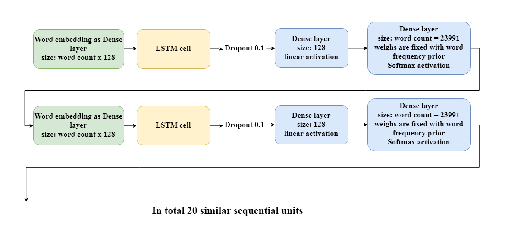
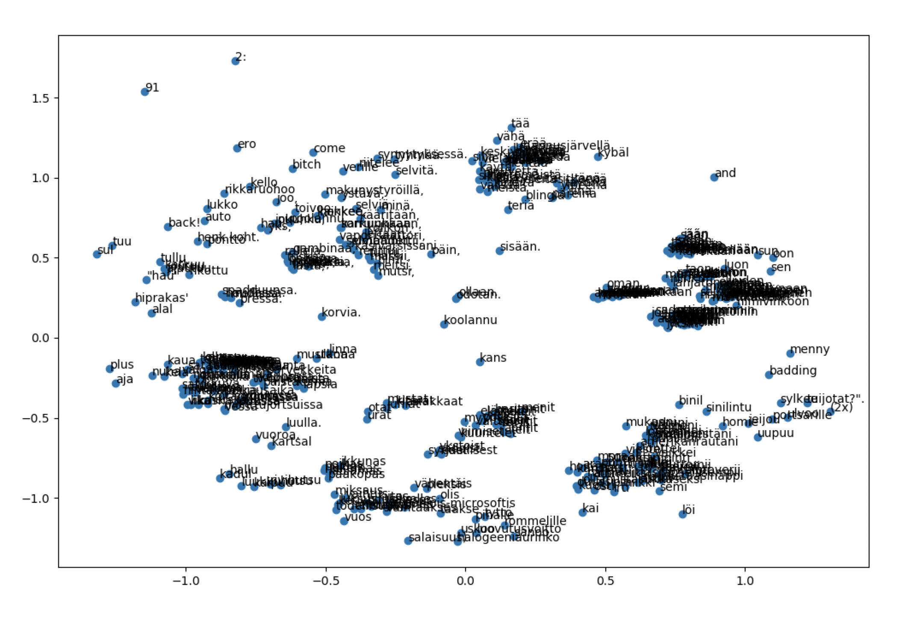
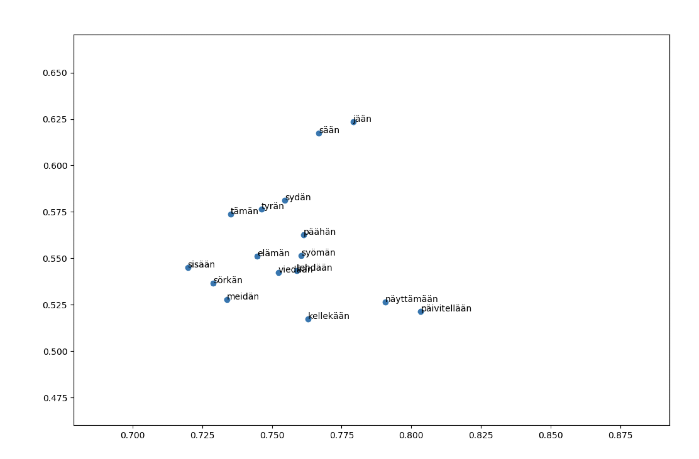
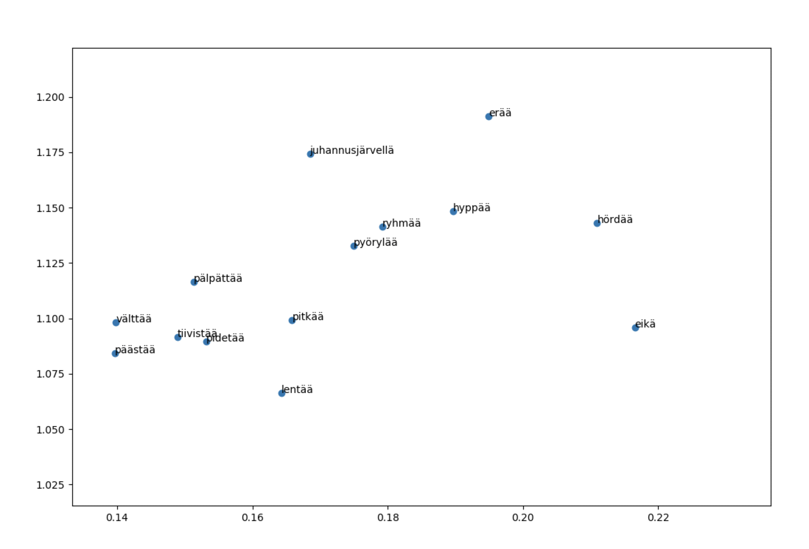

# Rap lyrics generation using LSTM and custom embeddings

## 1. Problem and data description

The problem is to create a freestyle rap generator in Finnish. When completed, the rap bot should be able to continue the rap based on a given first line. The generated sentence should ideally both rhyme and be meaningful. For that, a measure of rhyming words needs to be created as well as how well two words rhyme, and embed that information into words.

A language model for text generation can be created both in character and word level. In this project, we are concentrating on utilizing word level n-grams. An n-gram of words is a sequence of n words in order. Some examples of 6-grams are for example “A naughty dog chases a cat”, and “a cat with a long hair”. Fixed length n-grams are commonly used to create language models.

In language models, recurrent neural networks (RNN) are commonly used, including its variants GRU and LSTM. Both of these are already studied for plain text generation. However, enhancing them with a heuristic for creating rhymes is not yet implemented. Research questions of our study are:

How does the length of an input sequence effect on the ability of RNN to generate rap lyrics?
Which RNN structure is most suitable for generating rap lyrics?
How does the use of a rhyme heuristic effect on the performance of an RNN model in generating rap lyrics?

The data consisted of 18 480 lines (95 048 words) of Finnish rap lyrics. The lyrics were retrieved from [genius.com](https://genius.com). The artists were chosen based that their lyrics are known to favour rhyming lyrics i.e. their lyrics are also predictable[^1] The chosen artists were Heikki Kuula, Ruger Hauer, Stig, Brädi, Are, Petri Nygård, Paperi T, Stepa, Tuuttimörkö, Iso H, and Raptori.

[^1]: [https://mining4meaning.com/2017/06/30/rap-riimien-arvattavuudesta-ja-alkusoinnuista/](https://mining4meaning.com/2017/06/30/rap-riimien-arvattavuudesta-ja-alkusoinnuista/)

## Section 2. Method

The data was preprocessed into sequences of 20 input words corresponding to a single matching output word. The task of the model is to predict the next word according to the previous words given.

Our model consists of 20 long short-term memory (LSTM) units. Their structure was also covered in the lectures. Hidden size of 256 was used with a 0.1 dropout between the layers. The model was trained with logarithmic loss and Adam optimizer with batches of 128.

We chose to implement LSTM structure using Keras, because it provides higher abstraction than Pytorch for creating a language model. The structure of the model was inspired by a blog post of Jason Brownlee[^2]

[^2]: https://machinelearningmastery.com/text-generation-lstm-recurrent-neural-networks-python-keras/

The whole model consisted of 20 sequental LSTM and mid processing sells. The architecture of the model is presented in depiction below.

A weighted version of the Levenshtein distance, which also known as edit distance, was used as a heuristic of rhyming. Levenshtein distance is a measure of similarity of two words. The distance tells the number of insertions, deletion or substitutions needed to transform the word into another. Thus, the more similar the words are, the smaller the distance is. The distance is 0 only if the words are the same and it can be maximum the amount of letters in a longer word. Levenshtein distance between words *v* and *w* can be formal expressed as:

$$
{\displaystyle \qquad \operatorname {lev} _{v,w}(i,j)={\begin{cases}\max(i,j)&{\text{ if }}\min(i,j)=0,\\\min {\begin{cases}\operatorname {lev} _{v,w}(i-1,j)+1\\\operatorname {lev} _{v,w}(i,j-1)+1\\\operatorname {lev} _{v,w}(i-1,j-1)+1_{(v_{i}\neq w_{j})}\end{cases}}&{\text{ otherwise.}}\end{cases}}}
$$

Weighted Levenstein distance denotes that custom weights are used for fine-tuning the edit distance. To mimic rhyming, we used exponentially decaying weigh defined as:

$$w_i = 1/2^{-0.5 \cdot i}$$

Where i is the index of the letter. Two distance matrixes were computed, normal for measuring the similarity of the meaning of the word and reverse for measuring the rhyming of the word. The reverse indexes mean that the last letter of the word was at index position i=0. The computational implementation of Levenshtein distance was inspired by the [Wagner-Fischer algorithm](https://en.wikipedia.org/wiki/Wagner%E2%80%93Fischer_algorithm).

Next, we processed the whole dataset of n=23990 unique words to create a nxn matrix with elements M(i,j) denoting the Levenshtein distance between words i and j. For faster computation, the part of computing distance matrix was implemented in Scala. The size of the matrix was 4.6GB and was not included in version control.

Next, PCA was computed to both distance matrixes in order compress the information. These were saved as embedding-beginning.npy, (23990, 64) and embedding-end.npy (23990, 63)

After concatenating the embedding matrixes, we gained an custom embedding layer to be used in our model in between each LSTM cell.

## Results

Since an important goal of the project was to produced rhyming patterns, some kind of a metric for rhyming was needed. We decided to measure rhyming with the Levenshtein distance variant we also used for the embedding.

In the training data, consecutive last words of a row had an average distance of 0.9876, while random word pairs in the had an average distance of 1.4579. This was expected, as we had observed that rhyming words tended to be close to one another. For automatically generated text, a lower average distance would suggest a better model.

Neither of our models reached as low Levenshtein distances between as the training data. The values were 1.4811 for the custom embedding model and  1.3595 for the random embedding. The results at the lowest validation loss (for both models around 7) were somewhat unexpected, as they are virtually equal to random sampling, the random embedding being even lower. 

As for the meaningfulness of the lyrics, both of the models produced relatively nonsensical sentences. No overfitted meaningful sentences appeared either. However, the verses were mostly properly formatted in both models.

## Experiments

We tried using fully connected classification (no word embedding, just class labels as inputs and outputs). For a subset of data, that produced overfitted results. For the full dataset, the model was too large to be run in reasonable time.

Due to time constraints, we were not able to compare the performance of LSTM and GRU models.

## Conclusion

The modified Levenshtein distance was a decent measure of rhyming. This could be seen both intuitively in the visualizations, as well as in the consecutive last words having a smaller average distance.

These distances were retained in the word embedding as well. However, this did not help the model build rhyming patterns. This might have been due to eg. a small number of occurences per word, too few examples of any single rhyming pattern, or a number of other reasons.

## Code and Demos

The full source of the project can be found at [https://github.com/MasaSip/mc-diippi](https://github.com/MasaSip/mc-diippi). Under the demos folder there is a visual demo that shows how the rhyme embedding works. Rhyming words can be seen clustering in the scatter plot. The demo can be run under the name embedding_demo.py.

Example output of the text the models created can be found under the example_output folder in the demos folder. There is one 2000 word sample of each of the models.