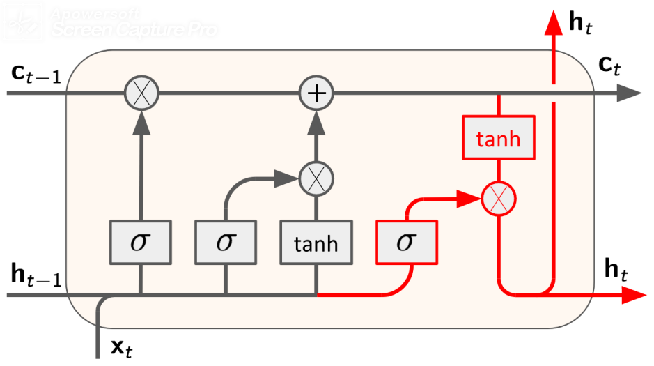

# Rap lyrics generation using LSTM and custom embeddings

# 1. Problem and data description

The problem is to create a freestyle rap generator in Finnish. When completed, the rap bot should be able to continue the rap based on a given first line. The generated sentence should ideally both rhyme and be meaningful. For that, a measure of rhyming words needs to be created as well as how well two words rhyme, and embed that information into words.

A language model for text generation can be created both in character and word level. In this project, we are concentrating on utilizing word level n-grams. An n-gram of words is a sequence of n words in order. Some examples of 6-grams are for example “A naughty dog chases a cat”, and “a cat with a long hair”. Fixed length n-grams are commonly used to create language models.

In language models, recurrent neural networks (RNN) are commonly used, including its variants GRU and LSTM. Both of these are already studied for plain text generation. However, enhancing them with a heuristic for creating rhymes is not yet implemented. Research questions of our study are:

How does the length of an input sequence effect on the ability of RNN to generate rap lyrics?
Which RNN structure is most suitable for generating rap lyrics?
How does the use of a rhyme heuristic effect on the performance of an RNN model in generating rap lyrics?

The data consisted of 18 480 lines (95 048 words) of Finnish rap lyrics. The lyrics were retrieved from [genius.com](https://genius.com). The artists were chosen based that their lyrics are known to favour rhyming lyrics i.e. their lyrics are also predictable[^1] The chosen artists were Heikki Kuula, Ruger Hauer, Stig, Brädi, Are, Petri Nygård, Paperi T, Stepa, Tuuttimörkö, Iso H, and Raptori.

[^1]: [https://mining4meaning.com/2017/06/30/rap-riimien-arvattavuudesta-ja-alkusoinnuista/](https://mining4meaning.com/2017/06/30/rap-riimien-arvattavuudesta-ja-alkusoinnuista/)

# Section 2. Method

The data was preprocessed into sequences of 20 input words corresponding to a single matching output word. The task of the model is to predict the next word according to the previous words given.

Our model consists of 20 long short-term memory (LSTM) units. Their structure was also covered in the lectures. Hidden size of 256 was used with a 0.1 dropout between the layers. The model was trained with logarithmic loss and Adam optimizer with batches of 128.

We chose to implement LSTM structure using Keras, because it provides higher abstraction than Pytorch for creating a language model. The structure of the model was inspired by a blog post of Jason Brownlee[^2]

[^2]: https://machinelearningmastery.com/text-generation-lstm-recurrent-neural-networks-python-keras/

Weighted Levenshtein distance, also known as edit distance, was used as a heuristic of rhyming. Levenshtein distance is a measure of similarity of two words. The distance tells the number of insertions, deletion or substitutions needed to transform the word into another. Thus, the more similar the words are, the smaller the distance is. The distance is 0 only if the words are the same and it can be maximum the amount of letters in a longer word.

Kaava: https://en.wikipedia.org/wiki/Levenshtein_distance 

$$
{\displaystyle \qquad \operatorname {lev} _{a,b}(i,j)={\begin{cases}\max(i,j)&{\text{ if }}\min(i,j)=0,\\\min {\begin{cases}\operatorname {lev} _{a,b}(i-1,j)+1\\\operatorname {lev} _{a,b}(i,j-1)+1\\\operatorname {lev} _{a,b}(i-1,j-1)+1_{(a_{i}\neq b_{j})}\end{cases}}&{\text{ otherwise.}}\end{cases}}}
$$

Weighted Levenstein distance denotes that custom weights are used for fine-tuning the edit distance. To mimic rhyming, we used exponentially decaying weigh defined as:

1/2*(-0.5*i)

Where i is the index of the letter. Two distance matrixes were computed, normal for measuring the similarity of the meaning of the word and reverse for measuring the rhyming of the word. The reverse indexes mean that the last letter of the word was at index position i=0. The computational implementation of Levenshtein distance was inspired by Wagner-Fischer algorithm https://en.wikipedia.org/wiki/Wagner%E2%80%93Fischer_algorithm 

XXX TÄHÄN KUVA DEMOAMAAN ETÄISYYTTÄ

Next, we processed the whole dataset of n=23990 unique words to create a nxn matrix with elements M(i,j) denoting the Levenshtein distance between words i and j. For faster computation, the part of computing distance matrix was implemented in Scala. The size of the matrix was 4.6GB and was not included in version control.

Next, PCA was computed to both distance matrixes in order compress the information. These were saved as embedding-beginning.npy, (23990, 64)
 and embedding-end.npy (23990, 63)

After concatenating the embedding matrixes, we gained an custom embedding layer to be used in our model in between each LSTM cell.

2.1. Method description. (2 pts)

The report should describe well the model used in the project. If the model was covered in the lectures, it is ok to describe the architecture (such as, e.g., the number of layers etc) without going into details (such as computations in a basic convolutional layer). If the model was not covered in the lectures, you need to provide enough details so that your classmates can understand it without checking external references.

* The model is not described.
* The model is described well but some details are missing.
* The model is described very well. I could implement the model based on the description.

2.2. Choice of the model. (2 pts)

* The proposed model is not reasonable for the task.
* The model is reasonable but some choices are questionable.
* The model is suitable for the task.

2.3. Bonus: Is the model novel and/or original? (2 pts)

* No
* Partly
* Yes, the model deserves to be presented in a conference

2.4. If you think that the model is not perfectly suitable for the task, please write your suggestions on how the model could be improved.

Section 3. Experiments and results (4 pts)

3.1. Are the experiments described well in the report? (2 pts)

* The experiments are not described.
* Experiments are described but some details are missing.
* Experiments are well described. I could reproduce the experiments based on the description.

3.2. Performance of the proposed model (2 pts)

* It is difficult to evaluate the performance (there is no baseline or no demo for tasks that require subjective evaluation).
* The results are adequate.
* The results are impressive (either close to the state of the art or good subjective evaluation).

3.3. Suggest what could be improved in the experiments.

Section 4. Conclusions (1 pt)

4.1. Conclusions are adequate:

* No
* Yes

4.2. Optional feedback on the conclusions.

Section 5. Evaluate the code. (3 pts)

* The code is not attached.
* The code looks messy.
* The code looks alright.
* The code is clean.

Section 6. Overall feedback (3 pts)

6.1. Bonus: Are the results worth presenting in a conference?

* No
* No, but some aspects of the project were exceptionally good.
* Maybe
* Yes

6.2. Mention something that your classmate did well.

6.3. Mention something that your classmate could improve at.

